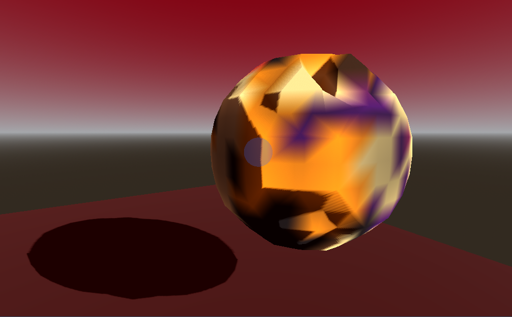

# Voxel Terrain Editor (Godot 4)

A real-time, interactive **voxel terrain editor** built in **Godot 4**, using **Marching Cubes** for smooth surface extraction.


The project focuses on:

* surface-based sculpting
* material painting
* clean separation between interaction, data, and rendering
* extensibility toward chunking and performance optimizations

This is both a learning project and a foundation for more advanced voxel terrain systems.

## Features (current)

### 🧱 Marching Cubes Terrain

* Smooth surface extraction from a scalar density field
* Linear interpolation along edges
* Correct triangle topology using the standard Bourke tables

### ✋ Surface-Based Sculpting

* Raycast from camera to terrain surface
* Brush aligned to the surface normal
* Adjustable brush radius
* Continuous sculpting (push / pull)

### 🎨 Material Painting

* Materials stored as **IDs**, not hard-coded colors
* Vertex colors generated during Marching Cubes
* Smooth interpolation of materials across edges
* Inferno color palette (perceptually uniform)
* Paint tool shares the same brush and raycast system as sculpting

### 🖌️ Brush Preview

* Transparent 3D brush indicator
* Color reflects current tool and selected material
* Radius updates in real time

### ⌨️ Controls (current)

| Action              | Input                        |
| ------------------- | ---------------------------- |
| Sculpt mode         | `1`                          |
| Paint mode          | `2`                          |
| Sculpt in           | Mouse Button                 |
| Sculpt out          | Mouse Button                 |
| Paint material      | Mouse Button (in paint mode) |
| Change brush radius | Mouse Wheel                  |
| Cycle material      | `Tab`                        |

*(Bindings may change as UI is added)*

---

## Project Structure

```
res://
├── terrain/
│   ├── voxel_terrain.gd        # Density & material fields, mesh generation
│   └── marching_cubes.gd       # Marching Cubes implementation
│
├── interaction/
│   └── voxel_interactor.gd     # Raycasting, tools, brush logic
│
└── main.tscn
```

## Technical Notes

* Godot version: **4.x**
* Rendering: `ArrayMesh` with vertex colors
* Physics: `StaticBody3D` + generated triangle collision
* Materials: `StandardMaterial3D` using vertex colors as albedo
* No chunking yet (single terrain mesh)


## Planned / Future Work

The project is intentionally incremental. Planned next steps include:

* 🧱 Chunked terrain (local rebuilds, streaming)
* ⚡ Performance optimizations
* 🎛️ UI for tool & material selection
* ↩️ Undo / redo
* 🎨 Texture-based materials (palette → texture lookup)
* 💾 Save / load terrain data
* 🧠 Additional tools (smooth, flatten, erosion)


## License

MIT